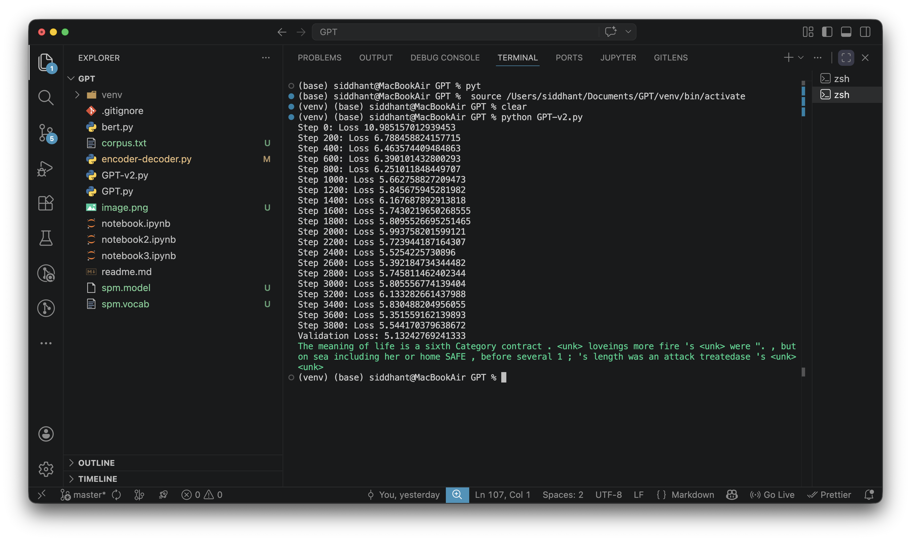
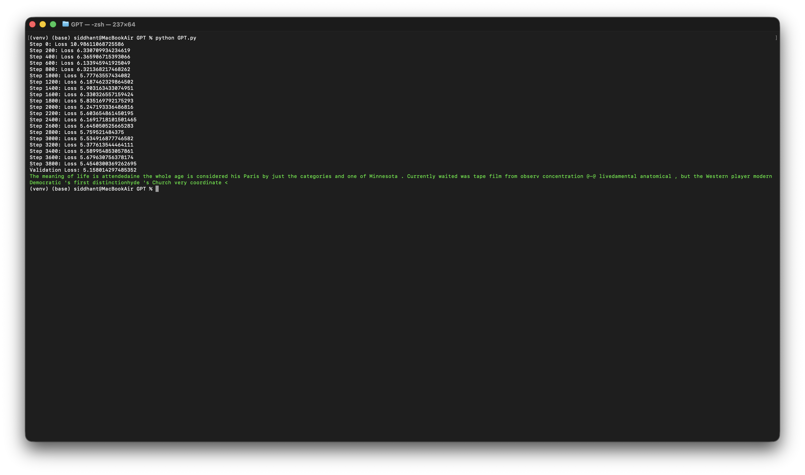
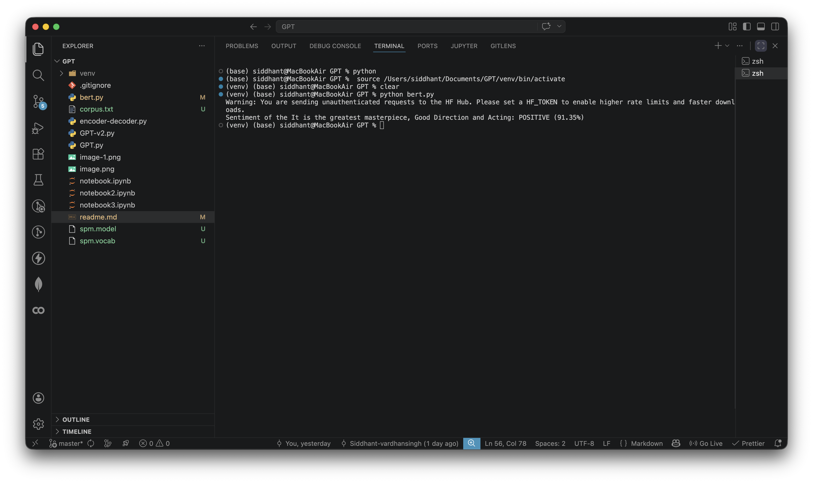

# 🧠 GPT Implementation (PyTorch)

A minimal, end-to-end implementation of a **GPT-style language model** built using PyTorch.
This project covers everything from **data loading → tokenization → model architecture → training → text generation**.

---

## Features:

- GPT.py: Implements a decoder-only Transformer with 4 layers and 4 attention heads. Uses `torch.nn.MultiheadAttention` for masked self-attention.
- GPT-v2.py: Implements the same architecture but does not use `torch.nn.MultiheadAttention`. Instead, it implements masked self-attention from scratch using `torch.nn.Linear` layers and manual masking.
- encoder-decoder.py: Implements a full Transformer architecture with both encoder and decoder blocks. The encoder processes the input sequence, while the decoder generates the output sequence using masked self-attention and cross-attention to the encoder outputs.
- bert.py: Implements a BERT-style encoder-only Transformer architecture. It adds |CLS| token at the beginning of the input sequence predict whether the ImDB movie review is positive or negative. It uses masked self-attention without causal masking, allowing the model to attend to all tokens in the input sequence.

---

## 🏗️ Architecture

### GPT.py and GPT-v2.py implement a **decoder-only Transformer** with the following components (14M parameters):

#### 🔹 Model Components

- **Embedding Layer**
  - Token Embedding
  - Positional Embedding

- **Decoder Blocks (Stacked 4 times)**
  - LayerNorm
  - Masked Multi-Head Attention (Causal Masking, using `torch.nn.MultiheadAttention` and 4 attention heads)
  - Feedforward Neural Network (MLP)
  - Residual Connections

- **Final LayerNorm + Linear Head**
  - Projects to vocabulary size

### encoder-decoder.py implements a **full Transformer architecture** with both encoder and decoder blocks (80M parameters):

#### 🔹 Model Components

- **Encoder**
  - Embedding Layer (Token + Positional)
  - Stacked Encoder Blocks (4 layers)
    - LayerNorm
    - Multi-Head Self Attention (no masking)
    - Feedforward Neural Network (MLP)
    - Residual Connections
- **Decoder**
  - Embedding Layer (Token + Positional)
  - Stacked Decoder Blocks (4 layers)
    - LayerNorm
    - Masked Multi-Head Self Attention (Causal Masking)
    - Cross-Attention to Encoder Outputs
    - Feedforward Neural Network (MLP)
    - Residual Connections

### bert.py implements a **BERT-style encoder-only Transformer** architecture:

#### 🔹 Model Components

- **Embedding Layer**
  - Token Embedding
  - Positional Embedding
  - |CLS| Token Embedding

- **Encoder Blocks (Stacked 4 times)**
  - LayerNorm
  - Masked Multi-Head Self Attention (No Causal Masking)
  - Feedforward Neural Network (MLP)
  - Residual Connections

- **Final LayerNorm + Classification Head**
  - Projects to number of classes (e.g., positive/negative for sentiment analysis)

---

## 📊 Dataset

### GPT.py and GPT-v2.py (Sequence Generation Task)

We use **WikiText-2**, a cleaned Wikipedia dataset.

- Source: PyTorch examples repo
- Format: Raw text
- Tokenization: GPT-2 tokenizer via `tiktoken`

### encoder-decoder.py (Translation Task)

We use a **IIT Bombay English-Hindi parallel corpus** for machine translation.

- Source: IIT Bombay
- Format: Parallel sentences (English-Hindi)
- Tokenization: Separate tokenizers for English and Hindi using `SentencePiece` by Google

### bert.py (Sentiment Analysis Task)

We use the **IMDB movie reviews dataset** for sentiment analysis.

- Source: IMDB
- Format: Raw text
- Tokenization: GPT-2 tokenizer via `tiktoken` (with added |CLS| token)

---

## Results

### GPT.py and GPT-v2.py

### encoder-decoder.py

### bert.py

